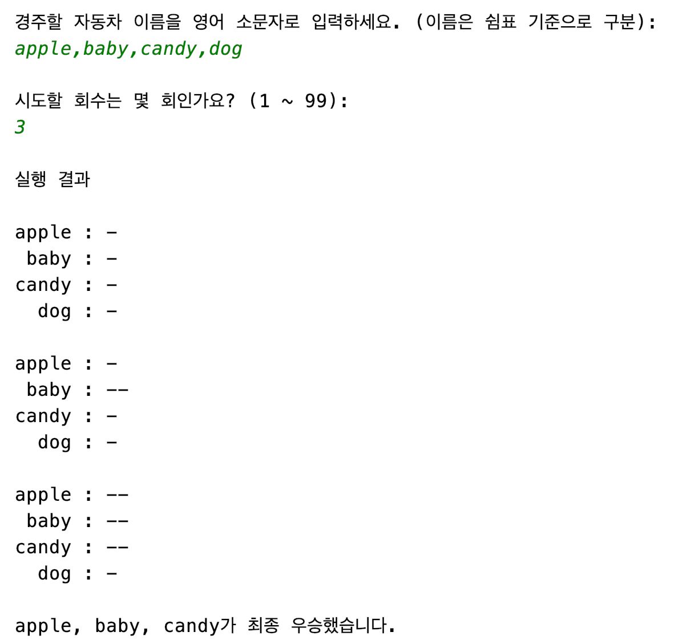

# 자동차 경주 게임

## 요구사항

- 문자열을 입력 받는다.
  - 입력 제한
    - 소문자
    - 쉼표: 1 ~ 19
  - 문자열을 쉼표로 구분하여 리스트로 변환한다.
  - 리스트 크기
    - 최소 2
    - 최대 20
      - ~~최대 12356630 (26^5 + 26^4 + 26^3 + 26^2 + 26)~~
      - ~~최대 수 < Integer.MAX_VALUE = 2147483647~~
  - 중복 이름 확인
- 숫자를 입력 받는다.
  - 입력 제한: 1 ~ 99
- 라운드를 N번 진행한다.
  - 랜덤 숫자를 생성한다.
  - 자동차 전진을 판단한다.
    - 0 ~ 3: 제자리 멈춤
    - 0 ~ 4: 한 칸 이동
  - 자동차를 전진시킨다.
    - + 0
    - + 1
- 최종 우승자를 보여준다.

## 입출력

- **경주할 자동차 이름을 입력하세요.**
  - 이름은 쉼표 기준으로 구분
    - `nextLine`, `split`
  - 이름은 5자 이하만 가능
  - 자동차 수: 2 이상
- **시도할 회수는 몇 회인가요?**
  - 숫자 입력
    - 0 이상
- **실행 결과**
  - 자동차1 : 현재 위치
  - 자동차2 : 현재 위치
- **자동차1, 자동차2가 최종 우승했습니다.**

## 도메인

- 자동차
  - 이름
    - 글자 수 제한: 5
  - 이동 거리: 0 이상
- 라운드
  - 0 이상
- 쉼표
- 순위
- 랜덤: 0 ~ 9
- 전진 조건
  - 0 ~ 3: 제자리 멈춤
  - 4 ~ 9: 1칸 이동

## 게임 상태

- 자동차 이름 입력 대기
- 시도 회수 입력 대기
- 라운드 진행
- 라운드 종료
- 경주 종료 판별
- 최종 우승 발표

---

